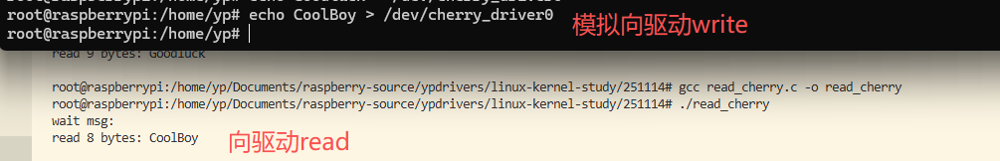

## 目标
* 实现一个字符驱动，read的时候返回历史写入的字符，write的时候，接收用户进程传来的字符；
* 用户进行read的时候，如果没有数据就睡眠等待
* 用户进行write的时候，如果驱动中的字符满了，就需要睡眠等待
* 用户可以使用ioctl来进行一些操作，比如取某一位的数据

## 学习内核的哪些技巧？
* 字符驱动的编写
* 睡眠等待的技巧

## 涉及到的API
```c
用户空间拷贝到内核
copy_from_user(void *to, const void __user *from, unsigned long n)
内核拷贝到用户空间
copy_to_user(void __user *to, const void *from, unsigned long n)
```
* DEFINE_WAIT
```c
#define DEFINE_WAIT(name)

#define DEFINE_WAIT_FUNC(name, function)					\
	struct wait_queue_entry name = {					\
		.private	= current,					\
		.func		= function,					\
		.entry		= LIST_HEAD_INIT((name).entry),			\
	}

#define DEFINE_WAIT(name) DEFINE_WAIT_FUNC(name, autoremove_wake_function)

```
* prepare_to_wait
```c
prepare_to_wait
/*
 * Note: we use "set_current_state()" _after_ the wait-queue add,
 * because we need a memory barrier there on SMP, so that any
 * wake-function that tests for the wait-queue being active
 * will be guaranteed to see waitqueue addition _or_ subsequent
 * tests in this thread will see the wakeup having taken place.
 *
 * The spin_unlock() itself is semi-permeable and only protects
 * one way (it only protects stuff inside the critical region and
 * stops them from bleeding out - it would still allow subsequent
 * loads to move into the critical region).
 */
void
prepare_to_wait(struct wait_queue_head *wq_head, struct wait_queue_entry *wq_entry, int state)
{
	unsigned long flags;

	wq_entry->flags &= ~WQ_FLAG_EXCLUSIVE;
	spin_lock_irqsave(&wq_head->lock, flags);
	if (list_empty(&wq_entry->entry))
		__add_wait_queue(wq_head, wq_entry);
	set_current_state(state);
	spin_unlock_irqrestore(&wq_head->lock, flags);
}
EXPORT_SYMBOL(prepare_to_wait);
```


* schedule
```c
asmlinkage __visible void __sched schedule(void)
{
	struct task_struct *tsk = current;

#ifdef CONFIG_RT_MUTEXES
	lockdep_assert(!tsk->sched_rt_mutex);
#endif

	if (!task_is_running(tsk))
		sched_submit_work(tsk);
	__schedule_loop(SM_NONE);
	sched_update_worker(tsk);
}
EXPORT_SYMBOL(schedule);
```

* finish_wait
```c
/**
 * finish_wait - clean up after waiting in a queue
 * @wq_head: waitqueue waited on
 * @wq_entry: wait descriptor
 *
 * Sets current thread back to running state and removes
 * the wait descriptor from the given waitqueue if still
 * queued.
 */
void finish_wait(struct wait_queue_head *wq_head, struct wait_queue_entry *wq_entry)
{
	unsigned long flags;

	__set_current_state(TASK_RUNNING);
	/*
	 * We can check for list emptiness outside the lock
	 * IFF:
	 *  - we use the "careful" check that verifies both
	 *    the next and prev pointers, so that there cannot
	 *    be any half-pending updates in progress on other
	 *    CPU's that we haven't seen yet (and that might
	 *    still change the stack area.
	 * and
	 *  - all other users take the lock (ie we can only
	 *    have _one_ other CPU that looks at or modifies
	 *    the list).
	 */
	if (!list_empty_careful(&wq_entry->entry)) {
		spin_lock_irqsave(&wq_head->lock, flags);
		list_del_init(&wq_entry->entry);
		spin_unlock_irqrestore(&wq_head->lock, flags);
	}
}
EXPORT_SYMBOL(finish_wait);
```
* wake_up_interruptible
```c
#define wake_up(x)			__wake_up(x, TASK_NORMAL, 1, NULL)
#define wake_up_nr(x, nr)		__wake_up(x, TASK_NORMAL, nr, NULL)
#define wake_up_all(x)			__wake_up(x, TASK_NORMAL, 0, NULL)
#define wake_up_locked(x)		__wake_up_locked((x), TASK_NORMAL, 1)
#define wake_up_all_locked(x)		__wake_up_locked((x), TASK_NORMAL, 0)
#define wake_up_sync(x)			__wake_up_sync(x, TASK_NORMAL)

#define wake_up_interruptible(x)	__wake_up(x, TASK_INTERRUPTIBLE, 1, NULL)
#define wake_up_interruptible_nr(x, nr)	__wake_up(x, TASK_INTERRUPTIBLE, nr, NULL)
#define wake_up_interruptible_all(x)	__wake_up(x, TASK_INTERRUPTIBLE, 0, NULL)
#define wake_up_interruptible_sync(x)	__wake_up_sync((x), TASK_INTERRUPTIBLE)
```


## 实现进程睡眠等待，驱动read,write操作:
