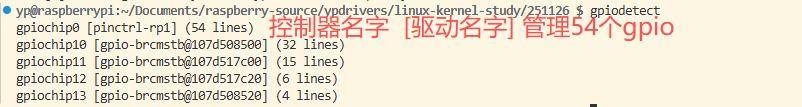
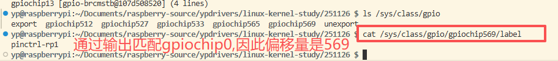

#### 使用Raspberry Pi 5点亮led灯

##### 遇到问题，在内核寻找gpio口需要寻找偏移量，否则无法控制

```c
#define IO_LED 26
#define IO_OFFSET 569 // Raspberry Pi 5 ,一些板子是0
struct gpio_desc *led = gpio_to_desc(IO_LED + IO_OFFSET);
```
##### 如何寻找这个偏移量？
```c
gpiodetect 列出gpio控制器
gpiochip0 [pinctrl-rp1] (54 lines)
gpiochip10 [gpio-brcmstb@107d508500] (32 lines)
gpiochip11 [gpio-brcmstb@107d517c00] (15 lines)
gpiochip12 [gpio-brcmstb@107d517c20] (6 lines)
gpiochip13 [gpio-brcmstb@107d508520] (4 lines)

ls /sys/class/gpio  #发现下面没有gpiochip0
export  gpiochip512  gpiochip527  gpiochip533  gpiochip565  gpiochip569  unexport

cat /sys/class/gpio/gpiochip569/label 输出gpio详细信息
pinctrl-rp1
```


